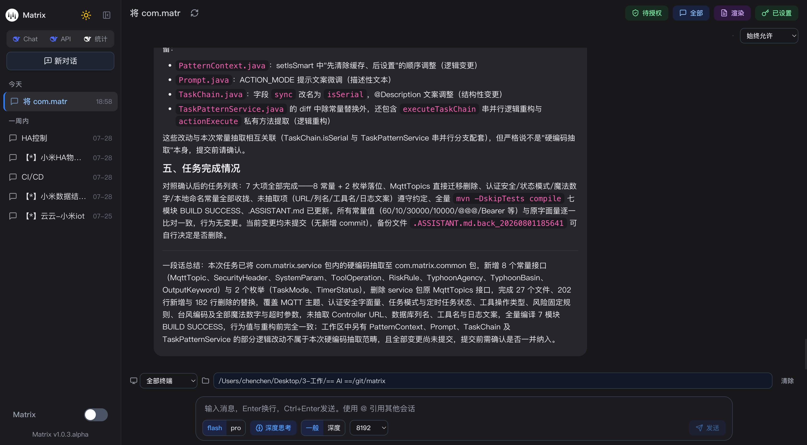
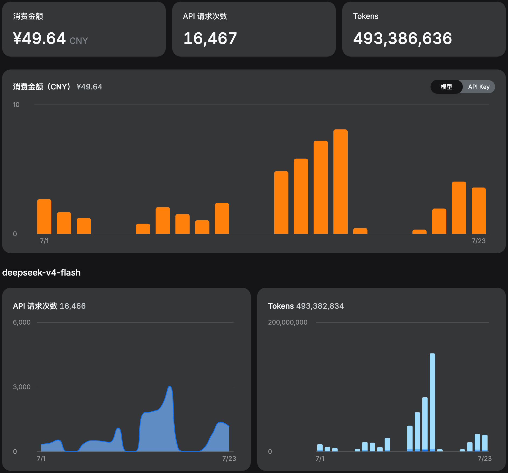

# Matrix

**Only supports Deepseek** — 基于 Deepseek API 的 AI 对话 + 指令执行系统。

---

## 主页面

### 模式
- **规划：** 构建任务计划
- **执行：** 直接执行任务
- **任务：** 任务列表（TAG + 观察者架构）
- **目标：** 任务列表（Graph + 观察者架构）

## 用量统计


## 目录结构

```
├── install/                  # 安装部署
│   ├── install.sh            # 一键安装脚本
│   ├── bin/                  # 服务管理脚本
│   │   ├── start.sh          # 启动服务（含 JDK 检查、进程管理）
│   │   ├── stop.sh           # 停止服务
│   │   ├── restart.sh        # 重启服务
│   │   └── proxy_server.py   # WebUI 代理服务器（Python3）
│   └── config/
│       └── application.yml   # 运行配置（端口、数据源、API Key 等）
│
├── matrix-local/             # [核心] 单机运行的服务端
│   ├── data/
│   │   ├── schema.sql        # 数据库建表 SQL（SQLite）
│   │   └── matrix-local.db   # SQLite 数据文件（自动生成）
│   └── src/
│       ├── LocalApplication.java    # 启动入口（主类）
│       ├── config/                  # 数据源配置（HikariCP + SQLite）
│       ├── dal/
│       │   ├── entity/
│       │   │   ├── LocalCache.java  # 本地缓存实体（替代 Redis）
│       │   │   └── LocalTimer.java  # 本地定时任务实体
│       │   └── mapper/
│       │       ├── LocalCacheMapper.java  # 缓存 CRUD（含 UPSERT）
│       │       └── LocalTimerMapper.java  # 定时任务 CRUD
│       ├── service/
│       │   └── LocalCacheService.java     # 本地缓存服务
│       └── primary/
│           ├── SyncExecutor.java          # 本地指令执行器（替代 MQTT 远程执行）
│           ├── LocalTaskComplete.java     # 本地任务完成处理
│           └── SqlServiceCache.java       # 本地缓存管理（带 Hash/Set 支持）
│
├── matrix-client/            # 终端客户端（设备端运行）
│   └── src/
│       ├── ClientApplication.java    # 启动入口
│       ├── mqtt/
│       │   ├── MqttConnection.java   # MQTT 连接管理
│       │   ├── MqttConsumer.java     # MQTT 消息消费（收到指令->执行->回执）
│       │   ├── MqttSubscriber.java   # MQTT 订阅
│       │   └── MqttRunner.java       # MQTT 自动启动（开关：matrix.mqtt.enabled）
│       └── service/
│           ├── CommandExecutor.java          # 指令执行接口
│           ├── impl/PCCommandExecutor.java   # PC 指令执行器（bash/cmd/powershell）
│           ├── Fingerprint.java              # 设备指纹接口
│           └── impl/PCFingerprintImpl.java   # PC 指纹生成（UUID+MAC+hostname -> SHA256）
│
├── matrix-cloud/             # 云服务端（多模块）
│   ├── matrix-cloud-gateway/ # 网关
│   │   └── src/
│   │       ├── GatewayApplication.java      # 入口
│   │       ├── filter/GatewayLogFilter.java # 请求日志
│   │       └── filter/LimitGlobalFilter.java # 限流
│   ├── matrix-cloud-service/ # 业务服务
│   │   └── src/
│   │       ├── ServiceApplication.java      # 入口
│   │       ├── controller/                  # API 接口（见下方说明）
│   │       ├── service/                     # 业务逻辑
│   │       │   ├── chat/                    # 对话/消息/会话
│   │       │   ├── user/                    # 用户/客户端
│   │       │   ├── agent/                   # 模式/技能
│   │       │   ├── task/                    # 任务管理
│   │       │   ├── app/                     # 脚本语言执行器
│   │       │   └── tool/                    # 工具
│   │       └── mqtt/                        # MQTT 发布/订阅
│   └── matrix-cloud-common/  # 公共模块（DTO/常量/工具类）
│
├── matrix-view/              # 前端界面
│   └── webui/                # React + Vite + TypeScript + Tailwind
│       ├── src/
│       │   ├── App.tsx                # 主应用（含 ErrorBoundary）
│       │   ├── components/
│       │   │   ├── ChatArea.tsx       # 聊天主区域
│       │   │   ├── Sidebar.tsx        # 侧边栏（会话列表）
│       │   │   ├── InputBar.tsx       # 输入栏（模型/思考模式/发送）
│       │   │   ├── MessageBubble.tsx  # 消息气泡
│       │   │   ├── TaskAuthModal.tsx  # 任务授权弹窗
│       │   │   ├── ApiKeyModal.tsx    # API Key 设置
│       │   │   └── ...
│       │   ├── store/                 # Zustand 状态管理
│       │   │   ├── chatStore.ts       # 对话状态（会话/消息/流式）
│       │   │   ├── apiKeyStore.ts     # API Key
│       │   │   ├── taskAuthStore.ts   # 任务授权
│       │   │   └── ...
│       │   └── utils/
│       │       ├── api.ts             # 聊天 SSE 接口
│       │       └── apiClient.ts       # HTTP 客户端封装
│       └── vite.config.ts            # 开发代理 localhost:10906
│
├── settings/                  # 本地配置文件
│   ├── risk-level.yml        # 风险等级配置
│   ├── skill/                # 技能目录（如 pdf, query-typhoon）
│   │   └── pdf/SKILL.md      # PDF 技能定义
│   ├── app/                  # 脚本语言执行器配置
│   │   ├── shell/            # sh, bash, zsh, ksh, csh
│   │   ├── script/           # python, node, lua, ruby, php, perl, R
│   │   ├── compile/          # java, go, rust, kotlin
│   │   ├── text/             # sed, awk
│   │   └── windows/          # powershell, batch, vbscript
│   └── MEMORY.md             # 服务记忆文件
│
├── logs/                     # 日志目录
│   ├── info/                 # 普通日志
│   └── error/                # 错误日志
│
├── pom.xml                   # Maven 父 POM（模块聚合）
└── wiki/                     # 文档（预留）
```

---

## 快速开始

### 一键安装

```bash
curl -fsSL https://gitee.com/za96421955/matrix/raw/release/latest/install/install.sh | bash
```

安装过程：
1. 检测 DEEPSEEK_API_KEY（未设置则交互输入）
2. 下载 JDK21（内置包，自动解压至 ~/.jdks）
3. 下载 JAR 分卷并合并（matrix-local-1.0.2.jar）
4. 下载 WebUI 静态资源
5. 自动启动服务

安装完成后，使用 `matrix` 命令管理服务：

| 命令 | 功能 |
|------|------|
| `matrix start` | 启动后端服务 + WebUI |
| `matrix stop` | 停止服务 |
| `matrix restart` | 重启服务 |
| `matrix status` | 查看运行状态 |
| `matrix logs` | 查看后端日志 |
| `matrix webui-logs` | 查看 WebUI 日志 |
| `matrix update` | 更新升级 |
| `matrix uninstall` | 卸载 |

安装目录：`~/.matrix/local/`

---

## 各模块操作说明

---

### 1. local 模块（单机运行核心）

**matrix-local** 是项目的核心模块，将所有功能整合为一个单体应用，开箱即用。

#### 启动方式

```bash
# 方式一：使用 matrix 命令（安装后）
matrix start

# 方式二：直接运行 JAR
java -jar matrix-local-1.0.2.jar

# 方式三：IDEA 开发
# 运行 LocalApplication.java 主类
```

#### 启动后访问

```
后端 API: http://localhost:10906/v1/
WebUI 界面: http://localhost:10908/
```

#### 数据存储

local 模块使用 **SQLite** 替代 MySQL + Redis，数据文件位置：

```
~/.matrix/local/data/matrix-local.db
```

所有数据自动持久化，无需额外配置数据库。

数据表（自动建表，详见 `matrix-local/data/schema.sql`）：

| 表名 | 说明 |
|------|------|
| `tbl_user_info` | 用户信息 |
| `tbl_client_info` | 终端设备 |
| `tbl_session_info` | 对话会话 |
| `tbl_message_info` | 聊天消息 |
| `tbl_user_api_key` | API Key |
| `tbl_task_info` | 任务记录 |
| `tbl_local_cache` | 本地缓存（替代 Redis） |
| `tbl_local_timer` | 本地定时任务 |

#### 本地缓存（替代 Redis）

local 模块内置了基于 SQLite 的缓存系统 `LocalCacheService`，支持：

- **KV 存储**：`put(key, value, ttl)` / `get(key)` / `delete(key)` / `keys(pattern)`
- **TTL 过期**：设置过期时间（秒），0 或负数表示永不过期
- **Hash 操作**：通过 `SqlServiceCache.getHash()` 操作，整体 JSON 序列化存储
- **Set 操作**：通过 `SqlServiceCache.getSet()` 操作，JSON 数组序列化存储
- **分布式锁**：`lock(key, ttl)` 基于缓存实现的简单互斥锁

> 注意：local 模式下所有缓存存储在 SQLite 数据库中，重启不丢失。如需 Redis，可切换至 cloud 模式。

#### 本地指令执行

local 模块的 `SyncExecutor` 会直接在本地执行 CLI 命令（通过 `PCCommandExecutor`），无需 MQTT 远程调用。

- macOS/Linux：使用 bash 执行
- Windows：使用 cmd.exe（带 `json` 格式参数时支持指定 `dir` 和 `command`）

#### 风险等级

配置文件 `settings/risk-level.yml` 控制各种操作的风险等级：

| 等级 | 含义 | 说明 |
|------|------|------|
| -1 | 禁止执行 | 如 `shutdown`、`sudo`、`rm`、`mkfs` 等危险操作 |
| 0 | 无风险 | 如 `ls`、`pwd`、`cat`、`grep`、`echo` 等安全操作 |
| 1 | 低风险 | CLI 默认等级，常规操作 |
| 2 | 中风险 | |
| 3 | 高风险 | `skill` 和 `app` 默认等级 |

WebUI 中可通过授权等级下拉框控制当前会话的授权级别：

| 授权等级 | 含义 |
|---------|------|
| -1 | 禁止执行 |
| 0 | 仅限安全操作 |
| 1 | 允许常规操作 |
| 2 | 允许敏感操作 |
| 3 | 始终允许 |

---

### 2. client 模块（终端客户端）

**matrix-client** 是跑在设备上的终端程序，功能如下：

#### 核心功能

| 功能 | 说明 |
|------|------|
| PC 指令执行 | `PCCommandExecutor`：在本地执行 bash/cmd/powershell 命令 |
| 设备指纹 | `PCFingerprintImpl`：通过 UUID + MAC 地址 + hostname 生成唯一设备 ID（`ha-ce-pc-{sha256}`） |
| MQTT 远程控制 | 可选功能。接收 MQTT 消息执行指令并回执（开关：`matrix.mqtt.enabled=true/false`） |
| 服务注册/心跳 | 启动时向服务端注册自身信息（设备名、OS 信息等），定时发送心跳 |

#### 设备指纹生成逻辑

1. 获取系统 UUID（Mac: `system_profiler SPHardwareDataType` / Linux: `/sys/class/dmi/id/product_uuid` / Windows: WMI）
2. 获取主网卡 MAC 地址
3. 拼接后 SHA-256 哈希
4. 最终 ID 格式：`ha-ce-pc-{hash}`

#### 配置项（application.yml）

```yaml
matrix:
  client:
    name: 个人PC            # 设备显示名称
    desc: 个人办公           # 设备描述
  mqtt:
    enabled: false          # MQTT 是否启用（local 模式通常关闭）
```

---

### 3. cloud 模块（云服务端）

**matrix-cloud** 是一个多模块项目，包含三个子模块：

#### matrix-cloud-gateway（网关）

- 请求日志记录（`GatewayLogFilter`）
- 限流过滤（`LimitGlobalFilter`）
- 健康检查：`GET /health/check`

#### matrix-cloud-service（业务服务）

完整的 REST API，路径前缀 `/v1`。

##### Chat 接口

| 方法 | 路径 | 说明 |
|------|------|------|
| POST | `/v1/chat/submit` | 提交对话，返回 sessionId，后台异步处理 |
| POST | `/v1/chat/completions` | SSE 流式对话（获取实时推理内容） |

**提交对话请求体示例：**

```json
{
  "messages": [{"role": "user", "content": "你好"}],
  "model": "deepseek-v4-flash",
  "agent": "plan_agent",
  "pattern": "auto",
  "sessionId": 1,
  "clientId": "ha-ce-pc-xxx",
  "itemPath": "/Users/xxx/project",
  "thinking": {"type": "enabled"},
  "reasoning_effort": "high",
  "max_tokens": 8192
}
```

##### Session 接口

| 方法 | 路径 | 说明 |
|------|------|------|
| GET | `/v1/session/page/{pageNum}/{pageSize}` | 分页查询会话列表 |
| GET | `/v1/session/{sessionId}` | 获取会话详情 |
| GET | `/v1/session/isCompletions/{sessionId}` | 检查会话是否正在生成 |
| GET | `/v1/session/stop/{sessionId}` | 停止生成 |
| PUT | `/v1/session/updateTitle/{sessionId}` | 重命名会话 |
| PUT | `/v1/session/updateAgent/{sessionId}` | 更新会话绑定的技能 |
| PUT | `/v1/session/updateAuthLevel/{sessionId}` | 更新会话授权等级 |
| DELETE | `/v1/session/{sessionId}` | 删除会话 |

##### Message 接口

| 方法 | 路径 | 说明 |
|------|------|------|
| GET | `/v1/message/page/{sessionId}/{pageNum}/{pageSize}` | 分页查询消息（全部） |
| GET | `/v1/message/page/chat/{sessionId}/{pageNum}/{pageSize}` | 分页查询消息（仅对话） |
| GET | `/v1/message/{sessionId}/{messageId}` | 获取单条消息 |
| DELETE | `/v1/message/{sessionId}/{messageId}` | 删除单条消息 |

##### User 接口

| 方法 | 路径 | 说明 |
|------|------|------|
| GET | `/v1/user/checkApiKey` | 校验 API Key 是否有效 |
| GET | `/v1/user/getAuthLevel` | 获取用户默认授权等级 |
| DELETE | `/v1/user/ak` | 删除 API Key |
| POST | `/v1/user/ak/enable` | 启用 API Key |
| POST | `/v1/user/ak/disable` | 禁用 API Key |

##### Client 接口

| 方法 | 路径 | 说明 |
|------|------|------|
| GET | `/v1/client/list` | 获取在线设备列表 |
| POST | `/v1/client/register/{clientId}` | 设备注册 |
| POST | `/v1/client/heartbeat/{clientId}` | 心跳上报 |
| POST | `/v1/client/checkOnline/{clientId}` | 检查设备在线状态 |

##### Agent 接口

| 方法 | 路径 | 说明 |
|------|------|------|
| GET | `/v1/agent/list` | 获取可用技能列表 |
| POST | `/v1/agent/call` | SSE 调用技能 |

##### Task 接口

| 方法 | 路径 | 说明 |
|------|------|------|
| GET | `/v1/task/{taskId}` | 获取任务详情 |
| POST | `/v1/task/ack/{taskId}` | 任务回执 |
| GET | `/v1/task/waitingAuthList` | 获取待授权任务列表 |
| POST | `/v1/task/auth/{taskId}` | 用户授权/拒绝 |

#### matrix-cloud-common（公共模块）

提供全局共享的 DTO、常量、枚举、工具类，供 service 和 client 共同使用。

---

### 4. webui 模块（前端界面）

**matrix-view/webui** 是一个 React + TypeScript + Vite 前端应用。

#### 开发模式

```bash
cd matrix-view/webui
npm install
npm run dev
```

- 开发服务器端口：`10908`
- Vite 自动代理 `/v1/*` 到 `localhost:10906`

#### 生产模式

WebUI 静态文件位于 `~/.matrix/local/webui/`，由 `proxy_server.py`（Python3）提供服务。

Python 代理同时负责：
1. 提供静态文件服务
2. 反向代理 `/v1/*` 到后端 `localhost:10906`

#### WebUI 界面功能

| 区域 | 功能                                                      |
|------|---------------------------------------------------------|
| 侧边栏 | 会话列表、新建/删除/重命名会话                                        |
| 输入栏 | 文本输入、模型选择（flash/pro）、深度思考开关、思考深度（一般/深度）、输出长度（4096~32768） |
| 工具栏 | API Key 设置、Markdown 渲染切换、消息过滤（全部/对话）、待授权任务、刷新           |
| 授权等级 | 控制当前会话的指令执行权限                                           |
| 技能选择 | 技能模式下选择具体技能                                             |
| 模式切换 | 自动 / 规划 / 执行 / 任务 / 图                                   |
| 项目路径 | 编程模式下设置项目绝对路径，自动记录历史                                    |
| 终端选择 | 选择执行指令的目标设备                                             |
| 消息操作 | 删除单条消息、加载更多历史消息                                         |

#### 消息流式处理

1. 前端发送消息到 `POST /v1/chat/submit`
2. 后端返回 `sessionId` 后异步处理
3. 前端轮询 `GET /v1/session/isCompletions/{sessionId}` 判断是否完成
4. 完成时通过 `GET /v1/message/page/chat/{sessionId}/1/50` 获取结果
5. SSE 模式可直接通过 `/v1/chat/completions` 获取实时流式内容

---

## 配置说明

### 环境变量

| 变量 | 说明 | 是否必须 |
|------|------|---------|
| `DEEPSEEK_API_KEY` | Deepseek API Key | ✅ 必须 |

### 应用配置（application.yml）

| 配置项 | 默认值 | 说明 |
|--------|--------|------|
| `server.port` | `10906` | 后端 API 端口 |
| `matrix.client.name` | `个人PC` | 设备显示名 |
| `matrix.client.desc` | `个人办公` | 设备描述 |
| `matrix.service.api-key` | `${DEEPSEEK_API_KEY}` | Deepseek API Key |

### WebUI 端口

| 服务 | 端口 | 说明 |
|------|------|------|
| 后端 API | `10906` | HTTP API |
| WebUI | `10908` | 前端界面 + API 代理 |

---

## 可用 Skill

| Skill | 说明 |
|-------|------|
| `query-typhoon` | 查询全球热带气旋（台风/飓风）最新预警报文 |

Skill 配置位于 `settings/skill/` 目录，每个 Skill 是一个子目录，包含 `SKILL.md` 定义文件。

---

## 注意事项

1. **local 模式仅限单机使用**，不依赖 Nacos、Redis、MySQL 等外部中间件
2. **首次启动**会自动创建 SQLite 数据库和表结构
3. **WebUI 需要 Python3** 环境来运行代理服务器
4. **API Key** 通过环境变量 `DEEPSEEK_API_KEY` 传入，安装脚本会自动写入 shell 配置文件
5. **风险等级** 配置在 `settings/risk-level.yml`，可根据需要调整
6. **`技能`、`风险等级`可在交互过程中进行管理**
